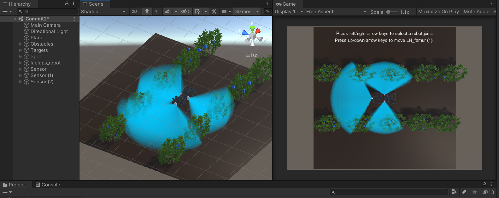

# Visualizing the Field of View of Optical or Lidar Sensors
# Using the Unity Development Platform
---
## Overview

The process of designing a perception system for a robot involves deciding what sensors are going to be used and what their position and rotation on the robot will be. The ability to visualise the combined field of view produced by camera and lidar sensors on the robot in simulation assists with such design decisions. There are several field of view visualisation tools freely available online but none of them is detailed, realistic or versatile enough to effectively compare multiple perception system designs in 3D space. Therefore, the goal of this project is to develop a three dimensional field of view visualisation tool and then use it to compare multiple perception system designs and reach a final decision on the design that will be used on our quadruped robot.

## Installation

1. Download and install the [Unity Development Platform]. The version of Unity used for this project is Unity 2020.3.27f1 (64-bit).
2. Download the FOV_Visualization Tool:
```sh
git clone https://bitbucket.org/csl_legged/mini-project-fov_visualisation/src/master.git
```
3. Open Unity Hub. On the projects tab, click Open, navigate to the project folder (probably named "master") and open it.
4. With the project open, go to the toolbar on top and click File -> Open Scene. Choose the Commit2.unity scene located in the Assets Folder.

## Quick Demo

1. To the left of the scene tab, on the Hierarchy tab the LaelapsII object can be seen highlighted in light blue color. Expand the object to reveal the Laelaps child object. Expand this as well.
2. Expanding the Laelaps object will reveal several child objects. The names of the sensor objects can be seen in fainted white color. That means that these objects are also present in the scene but they are deactivated. Select any one of these sensor objects from the Hierarchy tab. You will see that the Inspector tab on the right side of the Game window will display information about the selected object. To activate the selected object, check the checkbox near the name of the selected object in the Inspector tab.
3. Activate the objects Sensor, Sensor (1), Sensor (2), Sensor (3) and Sensor (4).
4. Start the simulation by pressing play (the play button is usually above the scene tab).
5. The Laelaps robot will start walking in the scene. Targets in its field of view will be highlighted in red color. If you wish to stop the robot's movement at any time, expand the LaelapsII object in the Hierarchy. Then click its child, Laelaps. In the Inspector tab, uncheck the animator checkbox that will appear.



## Instantiate sensors

To spawn sensors in determinate positions on the scene, the instantiation.txt file should be used.

1. Open the Commit2.unity scene (If it is not already open).
2. Deactivate the objects Sensor, Sensor (1), Sensor (2), Sensor (3) and Sensor (4) if they are active.
3. Configure the instantiation.txt file according to the desired experiment. For more information, read the "Configuration" section in the report. A typical instantiation configuration is written in typical_instantiation.txt. You can copy its contents in instantiation.txt as a demo. If the instantiation.txt cannot be configured while unity is opened, then you might need to close it to configure the file and then reopen it.
4. After configuring the instantiation.txt file, open the Commit2.unity scene and ress play to start the simulation.

To Further modify the FOV_Visualization tool to suit your needs, read the "Usage" and "How it was made" sections of the report.

[Unity Development Platform]: <https://unity3d.com/get-unity/download>
